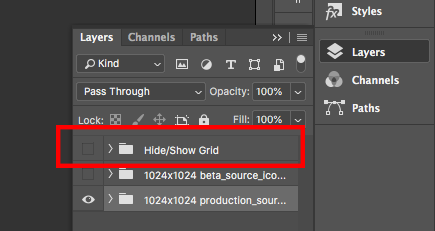

  

# React Native Icon Generator

## Read this blog post for more instructions
[https://medium.com/animal-labs-blog/easy-icon-generator-for-react-native-ad566ff71d26](https://medium.com/animal-labs-blog/easy-icon-generator-for-react-native-ad566ff71d26)

## Install repo

Eventually we can set this up as an npm package but for now, just do it manually.

`git clone` this repo into the top level of your React Native project

`cd` into newly created `react_native_icon_generator` folder

Install dependencies

`npm i` or `yarn`

Edit project name in `scripts/config.js` to match your parent React Native project name

Execute script to create icons

`node scripts/make_icons.js`

## Edit Master Icon

Open `icon_template.psd` with [Photoshop](https://www.adobe.com/products/photoshop.html)

Edit image to your liking

Show/hide this layer to display bounding box overlays

When you save, your assets should be exported automatically to the folder called: `icon_template-assets`

## Generating icons

First, commit your project. This is a fairly invasive process, writing things directly into the depths of your iOS and Android project hierarchies. It works well enough for me but I don't want you to experience any surprises.

Then, run: `node scripts/make_icons.js`

To generate your alternate dev mode / staging environment icons, add `--dev` or `-d`

`node scripts/make_icons.js --dev`

Should work like magic!

Reference this script in your root `package.json` and include it with any other build tools you may use.
